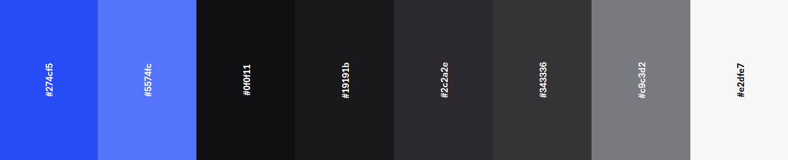

# My Cooking Hub


### Introduction 

My Cooking Hub is a website designed to enable users the ability to create and store there own personal recipes. The user can also view other users recipies aswell as edit and delete there own.

Visit the deployed webside [here]().

---

## Table of Contents

1. [User Experience (UX)](#user-experience-ux)
    1. [Project Goals](#project-goals)
    2. [User Stories](#user-stories)
    3. [Color Scheme](#color-scheme)
    4. [Typography](#typography)
    5. [Project Wireframes](#project-wireframes)
2. [Features](#features)
    1. [General](#general)
3. [Technologies Used](#technologies-used)
    1. [Languages Used](#languages-used)
    2. [Frameworks, Libraries and Programs Used](#frameworks-libraries-and-programs-used)
4. [Testing](#testing)
    1. [Testing User Stories](#testing-user-stories)
    2. [Code Validation](#code-validation)
    3. [Accessibility](#accessibility)
    4. [Tools Testing](#tools-testing)
    5. [Manual Testing](#manual-testing)
5. [Finished Product](#finished-product)
6. [Heroku Deployment](#heroku-deployment)
    1. [Heroku](#heroku)
7. [Credits](#credits)
    1. [Code](#code)
    2. [Images](#images)
8. [Achnowledgements](#acknowledgements)

## User Experience (UX)

### Project Goals

* The website provides a structure easy to understand and navigate
* The website has a responsive design to make it accessable accross all devices
* The website contains a database for storing created recipes
* The site allows the user to view a recipe and the cooking steps required for completing the recipe
* The website contains the tools for creating and managing a user account
* The site provides a calm and relaxing color scheme

### User Stories

* As a user i want to be able to view recipes created by others
* As a user i want to be able to create and manage a personal account
* As a user i want the tools available for creating a new recipe and adding the required cooking steps
* As a user i want to be able to edit my personal recipes
* I want to be able to share my recipes on social media platforms

### Color Scheme


### Typography

System Ui was used as the main font with sans-serif as a backup font.

### Project Wireframes

<details>
<summary>Mobile</summary>

#### Home Page 


</details>


## Features


[Back to top ⇧](#my-cooking-hub)

## Technologies Used

## Languages

- [HTML](https://en.wikipedia.org/wiki/HTML)
- [CSS](https://en.wikipedia.org/wiki/CSS)
- [JavaScript](https://en.wikipedia.org/wiki/JavaScript)
- [Python](https://en.wikipedia.org/wiki/Python_(programming_language))

## Frameworks, Libraries & Programs

- [Gitpod Enterprise](https://app.codeanywhere.com/)
  - Codeanywhere was used for writing, committing and pushing the code to GitHub.

- [Font Awesome](https://fontawesome.com/)
  - Font Awesome was used to add icons/images to the computer and player tiles.

- [Flask](https://flask.palletsprojects.com/en/3.0.x/)
  - Flask was used as the web application framework for use with Python.

- [Jinja](https://jinja.palletsprojects.com/en/3.1.x/)
  - Jinja was used as the templating engine for this application.

- [MongoDB](https://www.mongodb.com/)
  - MongoDB was used as the data platform for this application to perform CRUD functionality.

- [Chrome DevTools](https://developer.chrome.com/docs/devtools/)
  - Chrome DevTools was used throughout the development of the website to test ideas and responsiveness, as well as test functionality of the application and debug issues that arose.

- [W3C Markup Validator](https://validator.w3.org/)
  - W3C Markup Validator was used to validate the HTML code.

- [W3C CSS Validator](https://jigsaw.w3.org/css-validator/)
  - W3C CSS Validator was used to validate the CSS code.

- [JSLint](https://www.jslint.com/)
  - JSLint was used to validate the JavaScript.

- [CI Python Linter](https://pep8ci.herokuapp.com/)
  - The CI Python Linter was used to validate the Python.


[Back to top ⇧](#my-cooking-hub)

## Testing


[Back to top ⇧](#my-cooking-hub)

## Finished Product


[Back to top ⇧](#my-cooking-hub)

## Heroku Deployment

The project was deployed to Heroku using the following steps:

1. Create a `requirements.txt` file using the terminal command:

   ```bash
   pip freeze > requirements.txt
   ```

2. Create a `Procfile` with the terminal command:

   ```bash
   echo web: python app.py > Procfile
   ```

3. `git add` and `git commit` the new requirements and Procfile and then `git push` the project to GitHub.
4. Create a new app on the [Herkou website](https://dashboard.heroku.com/apps) by clicking the "New" button in your dashboard. Give it a name and assign the region to Europe.
5. From the Heroku dashboard of your newly created application, click on "Deploy" > "Deployment Method" and select GitHub.
6. Confirm the linking of the Heroku app to the correct GitHub repository.
7. In the Heroku dashboard for the application, click on "Settings" > "Reveal Config Vars".
8. Set the following config vars:

    | KEY | VALUE |
    | :-- | :-- |
    | IP | 0.0.0.0 |
    | PORT | 5000 |
    | SECRET_KEY | ANY_SECRET_KEY* |
    | MONGO_URI | `mongodb+srv://<username>:<password>@<cluster_name>.hrljbrx.mongodb.net/<database_name>?retryWrites=true&w=majority` |
    | DEBUG | TRUE** |

    - *Denotes a value that is specific to your app.

    - **This is set to true to enable us to see any bugs on the live site. __Please change to FALSE after deployment.__

    - To get your MONGO_URI read the MongoDB Atlas documentation [here](https://www.mongodb.com/docs/atlas/getting-started/).

9. In the Heroku dashboard, click "Deploy".
10. In the "Manual Deployment" section of this page, make sure the "Master Branch" is selected and then click "Deploy Branch".


[Back to top ⇧](#my-cooking-hub)


## Credits

### Images


[Back to top ⇧](#my-cooking-hub)


## Achnowledgements


[Back to top ⇧](#my-cooking-hub)